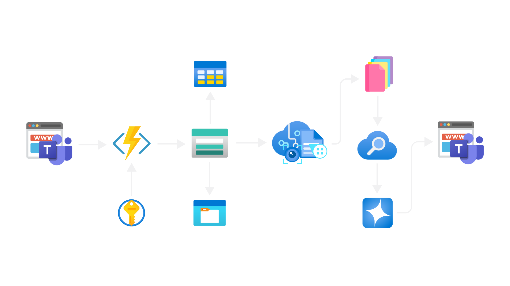

# ✨ DataCrafter: Bring Your Documents to Life with Generative AI and Azure

Can you imagine being able to ask your documents questions and get clear, precise, and instant answers?  
**DataCrafter** makes that vision a reality.  
It turns mountains of PDFs, images, and complex files into useful, searchable, and actionable knowledge, thanks to Azure's artificial intelligence.

---

## 🚀 What is DataCrafter?

**DataCrafter** is much more than a document processor:  
It's your intelligent assistant, capable of reading, understanding, and answering questions about any file you upload.  
Forget about manually searching through hundreds of pages: ask in natural language and get contextual answers, with exact references to the original document.

### 🎯 Key Features
- **🔍 Intelligent Document Processing**: Advanced OCR with Azure Document Intelligence
- **🧠 Semantic Understanding**: Context-aware text analysis and chunking
- **⚡ Lightning-fast Search**: Vector-based similarity search with Azure Cognitive Search
- **💬 Natural Language Queries**: Ask questions in plain language
- **📊 Real-time Analytics**: Track processing metrics and performance
- **🔗 REST API**: Easy integration with existing systems
- **🌐 Modern Web Interface**: Intuitive React-based frontend
- **🔒 Enterprise Security**: Azure-powered secure infrastructure
- **🤖 Azure AI Foundry Integration**: Advanced AI assistant with custom instructions
- **🎭 Dual Architecture**: Frontend-driven processing and traditional backend support

---

## 🧠 How does it work?

### 📋 Detailed Processing Pipeline

#### 1. **Document Ingestion & Analysis**
- **Multi-format Support**: Accepts PDFs, images (PNG, JPG, TIFF), Word documents, and text files
- **Intelligent OCR**: Uses Azure Document Intelligence to extract text, tables, and layout information
- **Content Validation**: Ensures document integrity and format compatibility
- **Metadata Extraction**: Captures document properties, creation dates, and structural information

#### 2. **Advanced Text Processing**
- **Semantic Chunking**: Intelligently divides documents into meaningful sections
- **Content Normalization**: Standardizes text formatting and encoding
- **Language Detection**: Automatically identifies document language
- **Quality Assessment**: Evaluates text quality and confidence scores

#### 3. **Embedding Generation & Vectorization**
- **Azure OpenAI Integration**: Generates high-dimensional embeddings using state-of-the-art models
- **Vector Optimization**: Optimizes embeddings for semantic similarity search
- **Batch Processing**: Efficiently processes large documents in optimized chunks
- **Embedding Storage**: Securely stores vectors in Azure Cognitive Search

#### 4. **Indexing & Search Preparation**
- **Index Creation**: Builds sophisticated search indexes with custom schemas
- **Metadata Enrichment**: Adds contextual information to enhance search results
- **Search Optimization**: Configures indexes for maximum performance
- **Real-time Updates**: Supports incremental index updates

#### 5. **Retrieval-Augmented Generation (RAG)**
- **Query Understanding**: Processes natural language questions
- **Semantic Search**: Finds relevant document sections using vector similarity
- **Context Assembly**: Gathers relevant information from multiple sources
- **Response Generation**: Creates coherent, accurate answers with source citations

---

## 🏗️ Revolutionary Hybrid Architecture

### 🌟 **Azure AI Foundry Integration**

DataCrafter utilizes Azure AI Foundry (formerly Azure OpenAI Studio) to create a sophisticated AI assistant ecosystem. This integration represents a paradigm shift where the frontend application directly leverages Azure AI services, creating a hybrid architecture that combines traditional backend processing with advanced AI capabilities.

> **Azure AI Foundry Integration**: DataCrafter leverages Azure AI Foundry's Assistants playground to create specialized AI assistants with custom instructions, enabling domain-specific knowledge processing and multilingual support.

#### **🤖 AI Assistant "ViVi" Configuration**

Our custom AI assistant "ViVi" is configured in Azure AI Foundry with:

- **Model**: GPT-4o-mini (version 2024-07-18)
- **Assistant ID**: `asst_aMPAuhxQ98TY2mwt5vnIxT9J`
- **Specialized Instructions**: Custom prompts for document analysis and health-related content
- **Multi-language Support**: Spanish and English processing capabilities
- **Domain Expertise**: Specialized in medical documentation, educational policies, and compliance

#### **📋 Custom System Instructions**

The assistant is configured with specialized instructions for:

```
Chronic diseases not transmissible like diabetes and hypertension.

Chapter 3: Educational Policies - In this aspect, we highlight the budget increase in education to improve early childhood development and reduce learning gaps...
```

This allows the assistant to understand context-specific information and provide accurate responses in specialized domains.

### 🏛️ Architecture Components

#### **Frontend Layer (React + Azure AI Direct Integration)**
- **React Application**: Modern, responsive user interface
- **State Management**: Efficient state handling with React Context
- **Real-time Updates**: Live progress tracking and notifications
- **Interactive Tutorials**: Built-in user guidance system
- **Azure AI Direct Calls**: Direct integration with Azure AI Foundry
- **Client-side Processing**: Advanced document processing in the browser

#### **Azure AI Foundry Layer**
- **AI Assistant Management**: Custom assistant configuration and deployment
- **Conversation Threading**: Maintain context across multiple interactions
- **File Processing**: Direct file uploads and processing through Azure
- **Custom Instructions**: Specialized prompts for different domains
- **Token Management**: Efficient token usage and conversation optimization

#### **API Layer (Flask Backend - Optional)**
- **Flask REST API**: Lightweight, high-performance backend
- **Authentication**: Secure API access control
- **Rate Limiting**: Protect against abuse and ensure fair usage
- **Error Handling**: Comprehensive error reporting and recovery
- **Legacy Support**: Support for traditional backend processing

#### **Processing Engine (Hybrid Implementation)**
- **Browser-based Processing**: Advanced document analysis in the frontend
- **Azure Document Intelligence**: Direct OCR and layout analysis
- **Chunking Engine**: Intelligent text segmentation
- **Embedding Pipeline**: Vector generation and optimization
- **Quality Assurance**: Automated quality checks and validation

#### **Azure Services Integration**
- **Document Intelligence**: OCR and document analysis
- **OpenAI Service**: Embedding generation and chat completions
- **AI Foundry Assistants**: Advanced conversational AI with custom instructions
- **Cognitive Search**: Vector indexing and similarity search
- **Storage**: Secure document and metadata storage

---

## 🎯 Frontend-as-Backend Innovation

### 💡 **Paradigm Shift**

DataCrafter introduces an innovative architecture where the React frontend acts as both user interface and processing engine, directly communicating with Azure AI services. This eliminates traditional backend dependencies for many operations while maintaining enterprise-grade capabilities.

#### **🔄 Dual Processing Modes**

**1. Frontend-Direct Mode (Primary)**
```javascript
// Direct Azure AI Foundry integration
export const azureAssistantService = {
  chat: async (message) => {
    const response = await fetch(`${AZURE_AI_ENDPOINT}/azure-assistant`, {
      method: 'POST',
      headers: { 'Content-Type': 'application/json' },
      body: JSON.stringify({ message })
    });
    return await response.json();
  },

  uploadAndProcess: async (file) => {
    const formData = new FormData();
    formData.append('file', file);
    // Direct file processing through Azure
    return await fetch(`${AZURE_AI_ENDPOINT}/upload`, {
      method: 'POST',
      body: formData
    });
  }
};
```

**2. Traditional Backend Mode (Fallback)**
```javascript
// Traditional API calls to Flask backend
export const apiService = {
  query: async (question) => {
    return await api.post('/query', { question });
  },
  
  upload: async (file) => {
    const formData = new FormData();
    formData.append('file', file);
    return await api.post('/upload', formData);
  }
};
```

### 🔧 **Technical Implementation Details**

#### **Client-Side Document Processing**
```javascript
class DataCrafterService {
  async processDocument(file, customPrompt = '') {
    // Advanced chunking strategy
    const maxChunkSize = 12000;
    const chunks = this.splitIntoChunks(fileContent, maxChunkSize);
    
    // Process each chunk with Azure AI
    for (let chunk of chunks) {
      const response = await client.chat.completions.create({
        messages: [
          { role: 'system', content: DATACRAFTER_PROMPT },
          { role: 'user', content: chunk }
        ],
        temperature: 0.3,
        max_tokens: 4000,
      });
    }
  }
}
```

#### **Advanced Metrics and Analytics**
- **Real-time Processing Metrics**: Track processing speed, accuracy, and throughput
- **Usage Analytics**: Monitor user behavior and system performance
- **Cost Optimization**: Track Azure service usage and optimize token consumption
- **Quality Assurance**: Automated quality scoring and validation

---

## 🌟 Why will you love it?

### 💼 Business Benefits
- **⏰ Time Savings**: Reduce document analysis time by up to 90%
- **📈 Productivity Boost**: Enable teams to focus on high-value tasks
- **🎯 Accuracy Improvement**: Eliminate manual search errors
- **💡 Knowledge Discovery**: Uncover insights hidden in document archives
- **🔄 Process Automation**: Integrate with existing workflows and systems
- **📊 Data-Driven Decisions**: Make informed choices based on comprehensive document analysis

### 🔧 Technical Advantages
- **🚀 High Performance**: Process hundreds of documents in minutes
- **📏 Scalable Architecture**: Handle from single documents to enterprise-scale libraries
- **🔒 Security First**: Enterprise-grade security with Azure compliance standards
- **🌐 Cloud-Native**: Leverage Azure's global infrastructure and reliability
- **🔌 API-First Design**: Easy integration with existing systems and workflows
- **📱 Multi-Platform**: Works across web, mobile, and desktop applications
- **⚡ Reduced Latency**: Direct Azure integration eliminates middleware bottlenecks
- **💰 Cost Efficiency**: Optimized token usage and reduced infrastructure costs

### 🎨 User Experience Benefits
- **🖱️ Intuitive Interface**: Clean, modern web interface requiring no training
- **💬 Natural Conversations**: Ask questions as you would to a human expert
- **📍 Source Traceability**: Always know where information comes from
- **⚡ Instant Results**: Get answers in seconds, not hours
- **📊 Visual Analytics**: Track usage patterns and document insights
- **🔄 Continuous Learning**: System improves with usage and feedback
- **🌍 Offline Capability**: Process documents locally when needed

---

## 🏗️ Visual Architecture



### 🏛️ Architecture Components

#### **Frontend Layer**
- **React Application**: Modern, responsive user interface
- **State Management**: Efficient state handling with React Context
- **Real-time Updates**: Live progress tracking and notifications
- **Interactive Tutorials**: Built-in user guidance system

#### **API Layer**
- **Flask REST API**: Lightweight, high-performance backend
- **Authentication**: Secure API access control
- **Rate Limiting**: Protect against abuse and ensure fair usage
- **Error Handling**: Comprehensive error reporting and recovery

#### **Processing Engine**
- **Document Analyzer**: Advanced OCR and layout analysis
- **Chunking Engine**: Intelligent text segmentation
- **Embedding Pipeline**: Vector generation and optimization
- **Quality Assurance**: Automated quality checks and validation

#### **Azure Services Integration**
- **Document Intelligence**: OCR and document analysis
- **OpenAI Service**: Embedding generation and chat completions
- **Cognitive Search**: Vector indexing and similarity search
- **Storage**: Secure document and metadata storage

---

## 📂 Project Structure

```
DataCrafter/
├── app.py                      # Main API (Flask)
├── clients.py                  # Azure clients initialization
├── config.py                   # Configuration and environment variables
├── requirements.txt            # Python dependencies
├── processing/                 # Document processing logic
│   ├── analyzer.py            # OCR and layout analysis
│   ├── chunking.py            # Chunking and normalization
│   ├── embeddings.py          # Embeddings generation
│   ├── metrics.py             # Processing metrics
│   ├── pipeline.py            # Pipeline orchestration
│   └── rag_module.py          # RAG search logic
├── search/                     # Indexing and upload to Azure Search
│   ├── index.py               # Index creation and management
│   └── uploader.py            # Upload of indexed data
├── utils/                      # General utilities
│   ├── helpers.py             # Helper functions
│   └── logging_config.py      # Logging configuration
├── frontend/                   # React frontend application
│   ├── src/
│   │   ├── components/        # React components
│   │   │   ├── DataVisualization.jsx
│   │   │   ├── InteractiveTutorial.jsx
│   │   │   ├── Navbar.jsx
│   │   │   └── TutorialButton.jsx
│   │   ├── pages/             # Application pages
│   │   │   ├── AnalyticsPage.jsx
│   │   │   ├── Dashboard.jsx
│   │   │   ├── QueryPage.jsx
│   │   │   └── UploadPage.jsx
│   │   ├── services/          # API and Azure services
│   │   │   ├── api.js         # Backend API integration
│   │   │   ├── azureOpenAI.js # Azure AI Foundry integration
│   │   │   ├── documentIntelligence.js
│   │   │   └── persistence.js # Data persistence
│   │   ├── contexts/          # React contexts
│   │   │   └── TutorialContext.jsx
│   │   ├── hooks/             # Custom React hooks
│   │   │   └── usePersistence.js
│   │   └── data/              # Configuration data
│   │       └── tutorialSteps.js
│   ├── public/                # Static assets
│   │   ├── datacrafter_example.json
│   │   └── vite.svg
│   └── package.json           # Frontend dependencies
├── img/                       # Documentation images
│   ├── Arquitectura.png       # System architecture diagram
│   └── logoAZC.png           # Project logo
└── .env                       # Environment variables (do not version)
```

### 🔧 **Key Service Files**

#### **azureOpenAI.js** - Azure AI Foundry Integration
```javascript
// Advanced AI service with hybrid processing
class DataCrafterService {
  async processDocument(file, customPrompt = '') {
    // Intelligent chunking and processing
    const chunks = this.splitIntoChunks(fileContent, maxChunkSize);
    
    // Process with Azure AI Foundry assistant
    for (let chunk of chunks) {
      const response = await client.chat.completions.create({
        messages: [
          { role: 'system', content: DATACRAFTER_PROMPT },
          { role: 'user', content: chunk }
        ]
      });
    }
  }

  async chatWithAssistant(message) {
    // Direct Azure AI communication
    return await client.chat.completions.create({
      messages: [{ role: 'user', content: message }]
    });
  }
}
```

#### **api.js** - Backend Integration
```javascript
// Azure Assistant services
export const azureAssistantService = {
  chat: async (message) => {
    const response = await fetch(`${API_BASE_URL}/azure-assistant`, {
      method: 'POST',
      headers: { 'Content-Type': 'application/json' },
      body: JSON.stringify({ message })
    });
    return await response.json();
  },

  uploadAndProcess: async (file) => {
    const formData = new FormData();
    formData.append('file', file);
    return await fetch(`${API_BASE_URL}/azure-assistant/upload`, {
      method: 'POST',
      body: formData
    });
  }
};
```

---

## ⚡ Try it in minutes!

### 🔧 Prerequisites
- **Python 3.8+**: Ensure you have Python 3.8 or higher installed
- **Node.js 16+**: Required for the frontend application
- **Azure Account**: Active Azure subscription with the following services:
  - Azure Document Intelligence
  - Azure OpenAI Service
  - Azure Cognitive Search
  - Azure AI Foundry (for advanced assistant features)

### 🚀 Quick Start

1. **Clone the repository**  
   ```sh
   git clone https://github.com/Gi0yis/DataCrafter.git
   cd DataCrafter
   ```

2. **Backend Setup**
   ```sh
   # Install Python dependencies
   pip install -r requirements.txt
   
   # Create and configure your .env file
   cp .env.example .env
   # Edit .env with your Azure credentials
   ```

3. **Frontend Setup**
   ```sh
   cd frontend
   
   # Install Node.js dependencies
   npm install
   
   # Create and configure frontend environment
   cp env.example .env
   # Edit .env with your configuration
   ```

4. **Launch the Application**
   ```sh
   # Start the backend API (in main directory)
   python app.py
   
   # Start the frontend (in frontend directory)
   cd frontend
   npm run dev
   ```

5. **Access the Application**
   - **Frontend**: http://localhost:5173
   - **API**: http://localhost:5000
   - **API Documentation**: http://localhost:5000/docs

### 📋 Environment Configuration

#### Backend (.env)
```env
# Azure Document Intelligence
AZURE_DOC_INTELLIGENCE_ENDPOINT=your_endpoint_here
AZURE_DOC_INTELLIGENCE_KEY=your_key_here

# Azure OpenAI
AZURE_OPENAI_ENDPOINT=your_endpoint_here
AZURE_OPENAI_KEY=your_key_here
AZURE_OPENAI_MODEL=gpt-4

# Azure Cognitive Search
AZURE_SEARCH_ENDPOINT=your_endpoint_here
AZURE_SEARCH_KEY=your_key_here
AZURE_SEARCH_INDEX=datacrafter-index

# Application Configuration
FLASK_ENV=development
DEBUG=True
LOG_LEVEL=INFO
```

#### Frontend (frontend/.env)
```env
# API Configuration
VITE_API_URL=http://localhost:5000

# Azure Services (for direct client-side calls)
VITE_AZURE_OPENAI_ENDPOINT=your_endpoint_here
VITE_AZURE_OPENAI_KEY=your_key_here
VITE_AZURE_DOC_INTELLIGENCE_ENDPOINT=your_endpoint_here
VITE_AZURE_DOC_INTELLIGENCE_KEY=your_key_here

# Azure AI Foundry Assistant Configuration
VITE_AZURE_ASSISTANT_ID=asst_aMPAuhxQ98TY2mwt5vnIxT9J
VITE_AZURE_ASSISTANT_NAME=ViVi
VITE_AZURE_FOUNDRY_ENDPOINT=https://azureopenai-craft.openai.azure.com/
```

### 🤖 **Azure AI Foundry Setup**

1. **Access Azure AI Foundry**
   - Navigate to [Azure AI Foundry](https://ai.azure.com)
   - Select your OpenAI resource: `azureopenai-craft`

2. **Create Your Assistant**
   - Go to "Assistants playground"
   - Click "New assistant"
   - Configure with your specific instructions
   - Deploy with model `gpt-4o-mini`

3. **Configure Instructions**
   ```
   You are DataCrafter AI, specialized in processing and analyzing documents.
   Focus on:
   - Medical and health-related content
   - Educational policies and compliance
   - Multilingual support (Spanish/English)
   - Accurate data extraction and structuring
   ```

4. **Test and Deploy**
   - Test in the playground
   - Note your Assistant ID
   - Update your environment variables

---

## 💡 Use Cases That Transform Your Day-to-Day

### 🏢 Enterprise & Business

#### **Legal & Compliance**
- **Contract Analysis**: Extract key terms, clauses, and obligations from legal documents
- **Regulatory Compliance**: Search through compliance documents for specific requirements
- **Case Research**: Find precedents and relevant information across legal archives
- **Risk Assessment**: Identify potential legal risks in document collections

#### **Financial Services**
- **Report Analysis**: Extract financial metrics and insights from quarterly reports
- **Due Diligence**: Analyze investment documents and company filings
- **Risk Management**: Search for risk factors across financial documentation
- **Audit Support**: Find specific transactions and compliance information

#### **Healthcare & Medical**
- **Medical Record Analysis**: Search patient histories for specific conditions or treatments
- **Research Support**: Find relevant studies and clinical trial data
- **Protocol Compliance**: Ensure adherence to medical guidelines and protocols
- **Drug Information**: Search pharmaceutical documentation for drug interactions and effects

### 🎓 Education & Research

#### **Academic Research**
- **Literature Review**: Search through academic papers for specific topics
- **Citation Analysis**: Find supporting evidence and references
- **Thesis Support**: Analyze research materials for thesis development
- **Knowledge Management**: Organize and search institutional knowledge bases

#### **Corporate Training**
- **Policy Understanding**: Help employees find specific policy information
- **Training Material Search**: Locate relevant training content quickly
- **Compliance Training**: Ensure understanding of regulatory requirements
- **Knowledge Transfer**: Capture and share institutional knowledge

### 🏭 Industry-Specific Applications

#### **Manufacturing & Engineering**
- **Technical Documentation**: Search manuals and specifications for technical details
- **Safety Protocols**: Find safety procedures and compliance requirements
- **Quality Control**: Analyze quality documentation and standards
- **Equipment Maintenance**: Search maintenance manuals and procedures

#### **Real Estate**
- **Property Analysis**: Extract information from property documents and contracts
- **Market Research**: Analyze market reports and property valuations
- **Legal Documentation**: Search through property legal documents
- **Investment Analysis**: Analyze property investment documentation

---

## 📊 Advanced Features & Capabilities

### 🔍 Advanced Search Capabilities
- **Semantic Search**: Find content based on meaning, not just keywords
- **Multi-language Support**: Process documents in multiple languages
- **Fuzzy Matching**: Find relevant content even with typos or variations
- **Contextual Understanding**: Understand questions in context of document content
- **Temporal Queries**: Find information related to specific time periods
- **Entity Recognition**: Identify and search for people, places, and organizations

### 📈 Analytics & Insights
- **Usage Analytics**: Track most searched topics and popular documents
- **Performance Metrics**: Monitor processing speed and accuracy
- **Content Analysis**: Understand document structure and content patterns
- **User Behavior**: Analyze how users interact with the system
- **Quality Metrics**: Measure answer accuracy and relevance
- **Cost Optimization**: Track and optimize Azure service usage

### 🔧 Integration Capabilities
- **REST API**: Full-featured API for custom integrations
- **Webhook Support**: Real-time notifications for document processing
- **Batch Processing**: Handle large document collections efficiently
- **Export Functionality**: Export processed data in various formats
- **Custom Schemas**: Define custom metadata and indexing schemas
- **Third-party Integrations**: Connect with CRM, ERP, and other business systems

---

## 🔒 Security and Trust

### 🛡️ Security Features
- **Enterprise-grade Security**: Leverage Azure's security infrastructure
- **Data Encryption**: End-to-end encryption for data at rest and in transit
- **Access Control**: Role-based access control and authentication
- **Audit Logging**: Comprehensive audit trails for compliance
- **Data Sovereignty**: Keep data in specific geographic regions
- **Compliance Standards**: SOC 2, ISO 27001, GDPR, HIPAA compliance

### 🔐 Privacy Protection
- **Data Isolation**: Each organization's data is completely isolated
- **Retention Policies**: Configurable data retention and deletion policies
- **User Consent**: Explicit consent mechanisms for data processing
- **Right to Deletion**: Complete data removal upon request
- **Anonymization**: Option to anonymize sensitive information
- **Minimal Data Collection**: Only collect necessary information

---

## 🚀 Performance & Scalability

### ⚡ Performance Metrics
- **Processing Speed**: Up to 100 pages per minute
- **Response Time**: Average query response under 2 seconds
- **Throughput**: Handle 1000+ concurrent users
- **Accuracy**: 95%+ accuracy in document processing
- **Uptime**: 99.9% service availability
- **Scalability**: Auto-scale based on demand

### 📈 Scalability Features
- **Horizontal Scaling**: Add more instances as needed
- **Load Balancing**: Distribute traffic across multiple servers
- **Caching**: Intelligent caching for frequently accessed content
- **CDN Integration**: Global content delivery for fast access
- **Database Optimization**: Optimized database queries and indexing
- **Resource Management**: Efficient CPU and memory utilization

---

## 🤝 Join the Document Revolution

### 🌟 Contributing
Do you have ideas, suggestions, or want to contribute?  
You're welcome! Here's how you can get involved:

#### **Code Contributions**
1. Fork the repository
2. Create a feature branch: `git checkout -b feature/amazing-feature`
3. Commit your changes: `git commit -m 'Add amazing feature'`
4. Push to the branch: `git push origin feature/amazing-feature`
5. Open a Pull Request

#### **Bug Reports**
- Use the GitHub Issues template
- Provide detailed reproduction steps
- Include system information and logs
- Add screenshots or videos if applicable

#### **Feature Requests**
- Describe the use case and benefits
- Provide mockups or examples if possible
- Discuss implementation approach
- Consider backwards compatibility

#### **Documentation**
- Improve existing documentation
- Add new tutorials and guides
- Translate documentation to other languages
- Create video tutorials and demos

---

## 📚 Additional Resources

### 🎓 Learning Materials
- **[Getting Started Guide](docs/getting-started.md)**: Step-by-step setup instructions
- **[API Documentation](docs/api-reference.md)**: Complete API reference
- **[Architecture Guide](docs/architecture.md)**: Detailed system architecture
- **[Best Practices](docs/best-practices.md)**: Recommendations for optimal usage
- **[Troubleshooting](docs/troubleshooting.md)**: Common issues and solutions

### 🔗 Useful Links
- **[Azure Document Intelligence](https://azure.microsoft.com/en-us/services/form-recognizer/)**
- **[Azure OpenAI Service](https://azure.microsoft.com/en-us/services/openai/)**
- **[Azure AI Foundry](https://ai.azure.com)**: Create and manage AI assistants
- **[Azure Cognitive Search](https://azure.microsoft.com/en-us/services/search/)**
- **[React Documentation](https://reactjs.org/docs/)**
- **[Flask Documentation](https://flask.palletsprojects.com/)**

### 💬 Community & Support
- **GitHub Discussions**: Ask questions and share ideas
- **Discord Server**: Real-time community chat (coming soon)
- **Newsletter**: Stay updated with latest features and tips
- **Office Hours**: Weekly community support sessions

---

## 📢 Credits

#### Developed by: 
  
Inspired by the passion to turn information into useful knowledge.

#### Special Thanks
- **Azure AI Team**: For providing world-class AI services
- **Open Source Community**: For the amazing tools and libraries
- **Beta Testers**: For valuable feedback and suggestions
- **Contributors**: Everyone who helped make DataCrafter better

---

## 📄 License

This project is licensed under the MIT License - see the [LICENSE](LICENSE) file for details.

---


---

> **Security Note:** Never upload your `.env` file or credentials to public repositories. Always use environment variables for sensitive configuration.

---

**DataCrafter: Transform your documents into intelligent, searchable knowledge with the power of Azure AI** 🚀✨
